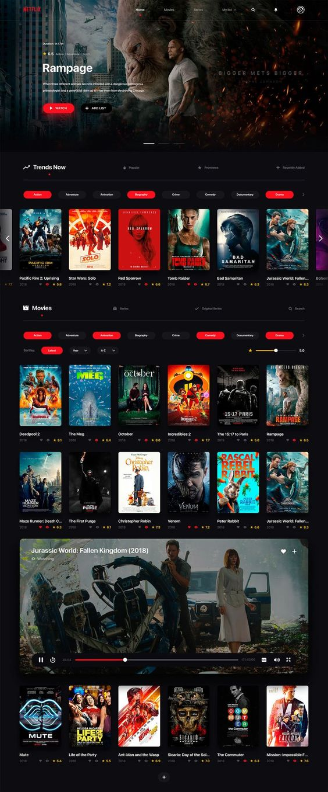

## Html,Css로 넷플릭스 페이지 만들기
--------
`dsadsad`

  <h3>참고한 넷플릭스 UI</h3>
  
  
<i>참고: <a href="https://pinterest.co.kr/pin/1900024831419932">https://pinterest.co.kr/pin/1900024831419932</a></i>

 

  <h3>완성한 넷플릭스 UI</h3>
  

--------
#### 사용한 폰트
 
https://fonts.google.com/specimen/Oswald?noto.script=Kore
